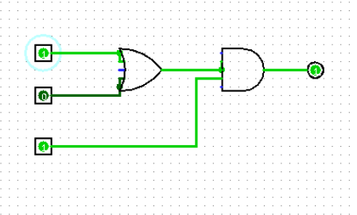

# Exercise Sheet

## Exercise1 – Variant 12
**Name:** Mohamed Dhiaeddine Hassine 
**Group:** FAF-233
### Part 1: Decimal, 1’s Complement, and 2’s Complement

For the following values, the decimal, 1’s complement, and 2’s complement are provided:

- **+44:**  
  - Decimal: +44  
  - 1’s Complement: `00101100`  
  - 2’s Complement: `00101100`

- **+17:**  
  - Decimal: +17  
  - 1’s Complement: `00010001`  
  - 2’s Complement: `00010001`

- **+58:**  
  - Decimal: +58  
  - 1’s Complement: `00111010`  
  - 2’s Complement: `00111010`

- **–23:**  
  - Decimal: -23  
  - 1’s Complement: `10010111`  
  - 2’s Complement: `11101001`

- **+92:**  
  - Decimal: +92  
  - 1’s Complement: `01011100`  
  - 2’s Complement: `01011100`

- **+63:**  
  - Decimal: +63  
  - 1’s Complement: `00111111`  
  - 2’s Complement: `00111111`

- **–45:**  
  - Decimal: -45  
  - 1’s Complement: `10101101`  
  - 2’s Complement: `11010011`

- **–19:**  
  - Decimal: -19  
  - 1’s Complement: `10010011`  
  - 2’s Complement: `11101101`

- **–69:**  
  - Decimal: -69  
  - 1’s Complement: `11000101`  
  - 2’s Complement: `10111011`

- **+65:**  
  - Decimal: +65  
  - 1’s Complement: `01000001`  
  - 2’s Complement: `01000001`

---

### Part 2: Column Addition

The following table summarizes the addition results using both complement methods:

| Column | Numbers         | 1’s Complement Result | 2’s Complement Result | Note                                           |
|--------|-----------------|-----------------------|-----------------------|------------------------------------------------|
| a      | +44 + +63      | 01101011 (+107)       | 01101011 (+107)       | Both positive; direct addition                 |
| b      | +17 + (–45)    | 11100011 (–28)        | 11100100 (–28)        | Mixed sign addition                            |
| c      | +58 + (–19)    | 00100111 (+39)        | 00100111 (+39)        | Mixed sign addition                            |
| d      | (–23) + (–69)  | 10100011 (–92)        | 10100100 (–92)        | Both negative; add end‐around carry (1’s comp) |
| e      | +92 + +65      | 10011101*             | 10011101*             | *Overflow: result out of range (157>127)       |

---

### Part 3: Flipped Numbers Calculation

The table below shows the results when using flipped numbers:

| Column | Flipped Numbers  | 1's Complement Sum | 2's Complement Sum | Note            |
|--------|------------------|--------------------|--------------------|-----------------|
| b      | -17 + +45        | 00011100 (+28)     | 00011100 (+28)     | -17 + 45 = +28  |
| c      | -58 + +19        | 11011000 (-39)     | 11011001 (-39)     | -58 + 19 = -39  |

## Exercise 2

**Analysis:** 
Detailed Analysis of Operations
1. Addition

    Technique:
    In an addition operation, users slide beads upward to “add” their corresponding values. Each column on the abacus represents a different place value, and users must “carry” beads when a column exceeds its maximum bead count.
    Cognitive Process:
    Addition on the Soroban requires both visual and motor coordination. As users become proficient, they begin to rely on an internal visualization (often called “Anzan”), which reduces the need for physical manipulation and speeds up the process.
    Efficiency & Time:
    – Beginners: May take 3–5 seconds per operation as they consciously manipulate beads and learn carry-over techniques.
    – Experienced Users: With practice, addition of simple two-digit numbers can be completed in approximately 2–3 seconds.
    Error Patterns:
    Common errors include misalignment of beads across columns or failure to carry over when necessary. With training, users develop muscle memory that reduces these errors significantly.

2. Subtraction

    Technique:
    Subtraction involves moving beads down and often requires “borrowing” from a higher column when the current column does not have enough beads.
    Cognitive Process:
    This operation engages working memory as the user must keep track of borrowed values while maintaining the mental image of the abacus.
    Efficiency & Time:
    – Beginners: Typically slower than addition due to the extra step of borrowing; operations may take 4–6 seconds.
    – Experienced Users: Once proficient, subtraction can be performed in roughly 3–4 seconds, as the mental visualization and physical gestures become more automatic.
    Error Patterns:
    Errors may occur in the borrowing process—failing to adjust the adjacent column correctly. With practice, these errors decline as the brain starts associating specific borrowing patterns with immediate corrective actions.

3. Multiplication

    Technique:
    Multiplication on the Soroban is generally executed as a series of addition operations. Users often break numbers into components (using the distributive property) and add the partial products together.
    Cognitive Process:
    This requires sequential operations and the ability to keep track of multiple intermediate results, which improves numerical working memory.
    Efficiency & Time:
    – Beginners: Multiplication might take noticeably longer (5–8 seconds) because it combines several steps.
    – Experienced Users: With practice and internalization of multiplication tables, experts can complete simple multiplications in under 5 seconds, as the need to physically manipulate the beads is reduced.
    Error Patterns:
    Errors can arise from miscalculating intermediate sums or misaligning place values. The use of a mental abacus technique (Anzan) helps to minimize these errors through repeated practice and increased neural efficiency in related brain regions.

4. Division

    Technique:
    Division is often performed by repeated subtraction (or by figuring out how many times the divisor “fits” into segments of the dividend) and involves shifting beads between columns to represent remainders and carry-overs.
    Cognitive Process:
    Division demands high levels of sequential reasoning and is more complex due to its iterative nature. The user must continually re-assess the remainder and adjust the bead configuration accordingly.
    Efficiency & Time:
    – Beginners: Can be the slowest operation, taking up to 8–10 seconds for multi-digit numbers, as the process is multi-stepped.
    – Experienced Users: With practice, especially when using a mental calculation strategy, divisions can be performed in around 5–7 seconds, with a noticeable improvement in speed once the steps become second nature.
    Error Patterns:
    Division errors often come from miscalculating remainders or failing to correctly shift the beads between place values. Proficient users learn to detect such errors quickly due to their heightened number sense and improved working memory.

Cognitive and Neural Efficiency

    Muscle Memory and Visualization:
    The repetitive movement of beads helps build muscle memory. Over time, operations transition from manual manipulation to mental visualization, thereby speeding up the process and reducing reliance on the physical action.

    Neural Plasticity:
    Studies using functional imaging have demonstrated that, with abacus training, the brain shifts toward using visuospatial strategies (primarily in the right frontoparietal network) rather than relying solely on language-based methods. This shift is directly related to improved speed and accuracy in performing operations.

    Transfer Effects:
    The efficiency gained in performing these operations not only translates to faster arithmetic on the abacus but also enhances general mental calculation skills. This improved processing speed and error reduction have been correlated with better overall mathematical proficiency and even greater cognitive flexibility in related tasks.

**Image:**  

---

## Exercise 3
**Image:**  

